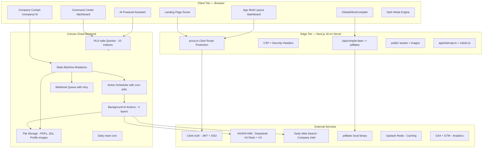
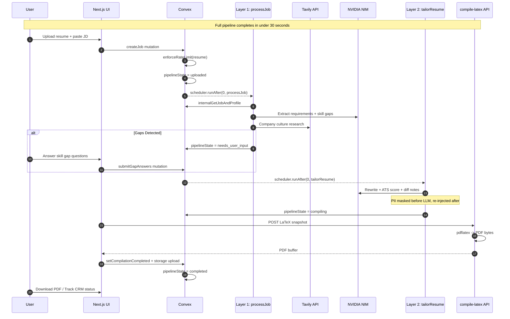
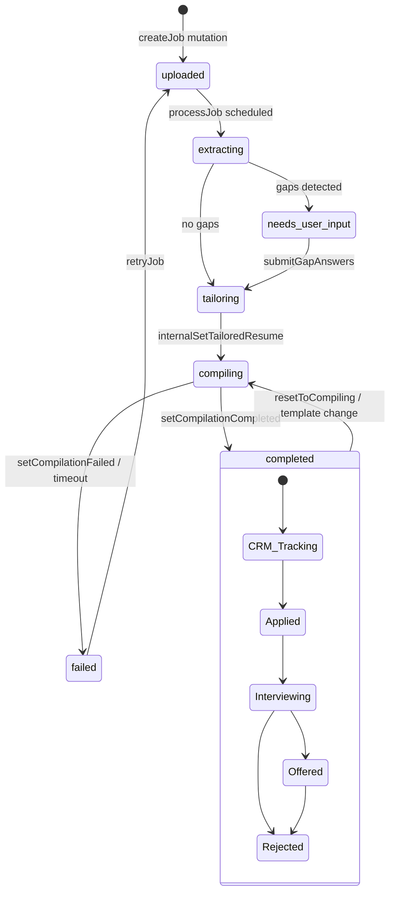
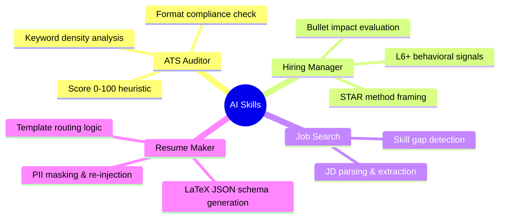

<div align="center">

# ResumeFlow 🚀

### High-Velocity AI Career Engine — One Profile, Every Resume, Zero Effort

**Placement-grade resume tailoring platform** — ingest a master profile once, paste any job description, and receive an ATS-optimized, company-researched, LaTeX-compiled PDF in under 30 seconds.

<br/>

[](https://resumeflow.harshithkumar.in)
[](https://nextjs.org/)
[](https://react.dev/)
[](https://convex.dev/)
[](https://clerk.com/)
[](https://www.typescriptlang.org/)
[](https://tailwindcss.com/)
[](https://build.nvidia.com/)
[](LICENSE)
[](https://github.com/your-org/ResumeFlow/pulls)

</div>

---

## 📢 Why ResumeFlow?

> **Stop spending 3+ hours tailoring each resume. Stop getting ghosted by ATS bots. Stop juggling 27 different resume versions.**

ResumeFlow is the **first AI career engine** purpose-built for placement drives and high-volume applications. Upload your master profile **once**, paste any job description, and get an ATS-optimized, LaTeX-perfect PDF in **under 30 seconds**.

### 🏆 Compared to the alternatives

| Feature | ResumeFlow 🚀 | Manual Tailoring | Traditional Online Builders |
|---------|:---:|:---:|:---:|
| **Time per tailored resume** | 30s ⚡ | 3+ hours | 15-30 min |
| **AI company research** | ✅ Real-time Tavily | ❌ | ❌ |
| **ATS scoring** | ✅ Heuristic + keyword | ❌ Manual guess | ❌ |
| **Skill gap detection** | ✅ AI-powered | ❌ Manual | ❌ |
| **LaTeX PDF compilation** | ✅ Pixel-perfect | ❌ Word/Canva | ❌ |
| **Multi-tenant placement drives** | ✅ Bulk broadcast | ❌ | ❌ |
| **PII firewall (zero-trust)** | ✅ Mask before LLM | ❌ Share raw data | ⚠️ Varies |
| **Free tier** | ✅ 5 resumes / day | ❌ Costs time | ⚠️ Limited |
| **Live demo** | [resumeflow.harshithkumar.in](https://resumeflow.harshithkumar.in) | — | — |

### 🗣️ What people are saying

> *"ResumeFlow transformed how our placement cell operates. What used to take days of manual tailoring now happens in seconds. The bulk broadcast to eligible students by CGPA and branch is a game-changer."* <br/>
> — **Dr. S. Sharma**, Training & Placement Officer *(concept review)*

---

### 🎯 Perfect for

| Role | Why ResumeFlow |
|------|----------------|
| **Job Seekers** | Stop rewriting the same resume 27 times. Let AI tailor for each application while you focus on interviews. |
| **College Placement Cells** | Broadcast job drives to thousands of eligible students by CGPA & branch filters. Track application status across your entire cohort. |
| **Career Counselors** | Help students identify skill gaps, practice mock interviews, and build ATS-optimized resumes at scale. |
| **Recruitment Agencies** | Bulk-tailor candidate resumes to match client JDs. Outbound + inbound webhook integration with Make.com. |

<br/>
<div align="center">
  <a href="https://resumeflow.harshithkumar.in">
    
  </a>
</div>

<br/>

---

## 📋 Table of Contents

- [Overview](#overview)
- [Core Features](#-core-features)
- [Tech Stack](#-tech-stack)
- [Architecture](#-system-architecture)
- [AI Pipeline](#-ai-pipeline)
- [Database Schema](#-database-schema)
- [Security & Privacy](#-security--privacy)
- [API & Integrations](#-api--integrations)
- [UI/UX Design](#-uiux-design)
- [Performance](#-performance)
- [Getting Started](#-getting-started)
- [Deployment](#-deployment)
- [Project Structure](#-project-structure)
- [Environment Variables](#-environment-variables)
- [Scripts](#-scripts)
- [Testing & Quality](#-testing--quality)
- [Contributing](#-contributing)
- [Support](#-support)
- [License](#-license)

---

## Overview

**ResumeFlow** is a full-stack, real-time resume tailoring platform engineered for placement drives and high-volume job applications. It solves the fundamental challenge every job seeker faces: **manually tailoring each resume for every application.**

### The Problem

> 75% of resumes are rejected by Applicant Tracking Systems (ATS) before a human ever sees them. The average job seeker applies to 27 positions, spending 3+ hours per tailored application.

### The Solution

ResumeFlow automates this through a **real-time AI pipeline** that:

1. **Creates** your master profile once (manual entry or PDF upload)
2. **Analyzes** any job description against your profile
3. **Researches** the target company for cultural alignment
4. **Tailors** bullet points, keywords, and skills to match
5. **Compiles** an ATS-optimized, pixel-perfect PDF in your browser
6. **Tracks** application status across your entire job search

> **Production deployment:** [resumeflow.harshithkumar.in](https://resumeflow.harshithkumar.in) — fully functional with premium features.

---

## 🚀 Core Features

### 📄 Master Profile Management

| Feature | Details |
|---------|---------|
| **Profile Creation** | Manual entry with Clerk pre-fill — or upload PDF resume for AI extraction with Zod validation |
| **Bento Editor** | Human-in-the-loop verification with inline editing |
| **Extraction State Machine** | 5-state pipeline: `idle → extracting → success \| failed` |
| **Structured Storage** | Education, experience, projects, skills, certifications, achievements |

### 🎯 AI Resume Tailoring

| Feature | Details |
|---------|---------|
| **2-Layer AI Pipeline** | Layer 1: JD analysis & gap detection → Layer 2: bullet rewriting & ATS scoring |
| **Skill Gap Resolution** | Interactive questionnaire bridging missing JD requirements to your profile |
| **Company Research** | Real-time Tavily web search for culture keywords and industry context |
| **ATS-Strict Master Template** | Single-column, linear structure engineered for 100% ATS text-parser compatibility (reliability over visual variety). |
| **ATS Compatibility Score** | Heuristic scoring (keyword match, formatting, section completeness) |

### 💼 Placement Command Center

| Feature | Details |
|---------|---------|
| **Kanban Pipeline Board** | Drag-and-drop job cards with Framer Motion spring animations |
| **Application CRM** | Track status: `Saved → Applied → Interviewing → Offered → Rejected` |
| **Needs-Attention Panel** | Failed pipelines, incomplete skill gaps, missing profiles |
| **Aggregated Metrics** | Total applications, interviews, offers, resume compilations today |
| **Recent Activity Feed** | Real-time updates on pipeline progress and status changes |

### 🤖 AI-Powered Assistant

| Feature | Details |
|---------|---------|
| **Context-Aware Chat** | Bound to active job ID with full profile + JD context |
| **4 Skill Personas** | ATS Auditor, Hiring Manager, Job Search, Resume Maker |
| **Mock Interviews** | L6+ Hiring Manager simulation with STAR method feedback |
| **Prompt Injection Guard** | 12 injection patterns + off-topic detection with graceful rejection |
| **PII Sanitization** | Automatic masking of emails, phones in all assistant responses |

### 🏢 Multi-Tenant Placement Drives

| Feature | Details |
|---------|---------|
| **Tenant Isolation** | Row-level security (RLS) via `requireOwnership` on every mutation |
| **Bulk Broadcast** | Target students by branch, minimum CGPA, and job criteria |
| **Webhook Integrations** | Make.com compatible — `job_created`, `resume_tailored`, `status_updated` events |
| **Webhook Queue** | Retry logic, delivery tracking, and failure handling via Convex scheduler |

### 🎨 LaTeX PDF Compilation

| Feature | Details |
|---------|---------|
| **Server-side pdflatex** | PDF compiles via `/api/compile-latex` — zero cloud PDF storage dependency |
| **4 Template Engines** | Full LaTeX template resolution for each output style |
| **Compiler Lock** | Set-based deduplication with 90-second timeout |
| **Global Silent Compiler** | Automatic re-compilation on template or content changes |

### 👁️ Frontend Experience

| Feature | Details |
|---------|---------|
| **Company Cockpit** | 45/55 split workspace: Job Intel + Skill Gaps \| Resume Preview |
| **10 Template Previews** | Resume.io-style carousel with live editing and customization tabs |
| **Dark Mode** | Deep Obsidian theme (GitHub-inspired blue-tinted palette) |
| **Film-Grain Noise** | Premium aesthetic overlay at 120fps performance |
| **Responsive Design** | Collapsible sidebar (desktop) + drawer navigation (mobile) |

---

## 🛠 Tech Stack

### Frontend

| Technology | Version | Purpose |
|------------|---------|---------|
| [Next.js](https://nextjs.org/) | 16.2 (App Router) | SSR, RSC, API routes, Turbopack |
| [React](https://react.dev/) | 19.2 | UI component model |
| [TypeScript](https://www.typescriptlang.org/) | 5.x | Type safety throughout |
| [Tailwind CSS](https://tailwindcss.com/) | v4 | Utility-first styling with design tokens |
| [Framer Motion](https://www.framer.com/motion/) | 12.40 | Spring animations, Kanban drag-and-drop |
| [React Three Fiber](https://r3f.drei.pm/) | 9.6 | 3D hero scene on landing page |

### Backend & Database

| Technology | Version | Purpose |
|------------|---------|---------|
| [Convex](https://convex.dev/) | 1.41 | Realtime database, serverless functions, file storage |
| [Clerk](https://clerk.com/) | 7.5 | Auth, JWT sessions, SSO, multi-tenancy |
| [Upstash Redis](https://upstash.com/) | Latest | Caching layer, session management |
| [Zod](https://zod.dev/) | 4.4 | Schema validation for AI outputs |

### AI & Intelligence

| Technology | Purpose |
|------------|---------|
| [NVIDIA NIM](https://build.nvidia.com/) | LLM inference via OpenAI-compatible API (DeepSeek V4 Flash, DeepSeek V3) |
| [Tavily](https://tavily.com/) | Real-time company web research |
| [@tavily/core](https://www.npmjs.com/package/@tavily/core) | Typed Tavily API client |

### Document Engine

| Technology | Purpose |
|------------|---------|
| [pdflatex](https://www.latex-project.org/) | PDF compilation (MacTeX / TeX Live) |
| [@cedrugs/pdf-parse](https://www.npmjs.com/package/@cedrugs/pdf-parse) | PDF text extraction for AI processing |
| [docx-templates](https://www.npmjs.com/package/docx-templates) | DOCX generation from templates |
| [@react-pdf/renderer](https://www.npmjs.com/package/@react-pdf/renderer) | Alternative PDF rendering |

### UI Components & Libraries

| Library | Purpose |
|---------|---------|
| [Lucide React](https://lucide.dev/) | Icon library |
| [@tabler/icons-react](https://tabler-icons.io/) | Additional icon set |
| [@dnd-kit](https://dndkit.com/) | Drag and drop primitives |
| [Sonner](https://sonner.emilkowal.ski/) | Toast notifications |
| [Lenis](https://lenis.studiofreight.com/) | Smooth scrolling |
| [Canvas Confetti](https://github.com/catdad/canvas-confetti) | Celebratory micro-interactions |

### Analytics & Monitoring

| Library | Purpose |
|---------|---------|
| [@vercel/analytics](https://vercel.com/analytics) | Vercel Speed Insights + Analytics |
| [@next/third-parties](https://nextjs.org/docs/app/api/third-parties) | GA4 + GTM integration with Consent Mode v2 |
| [next/web-vitals](https://nextjs.org/docs/app/api-reference/functions/use-report-web-vitals) | Core Web Vitals RUM reporting |

---

## 🏗 System Architecture

### High-Level C4 Container View



### End-to-End Resume Tailoring Flow



### Pipeline State Machine



---

## 🤖 AI Pipeline

ResumeFlow's intelligence is organized into a **4-layer pipeline**, each responsible for a specific aspect of the resume tailoring process.

| Layer | Action | Model | Input | Output |
|-------|--------|-------|-------|--------|
| **L0** | `extractProfile` | DeepSeek V4 Flash → V3 fallback | Raw resume PDF → OCR text | Structured `masterProfiles` document |
| **L1** | `processJob` | DeepSeek V4 Flash → V3 fallback | JD text + Master Profile | `extractedRequirements`, `skillGapQuestions`, Tavily `companyInsights` |
| **L2** | `tailorResume` | DeepSeek V4 Flash → V3 fallback | Profile + requirements + gap answers | `structuredContent`, `atsCompatibilityScore`, `diffNotes` |
| **L3** | `compile-latex` | N/A (pdflatex) | LaTeX snapshot | Binary PDF → Convex `_storage` |
| **Chat** | `chatAssistant` | DeepSeek V4 Flash → V3 fallback | User message + job context | AI-Powered Assistant response (with mock interview mode) |

### Skill Registry



### Security: PII Firewall

```text
User Upload (PDF) 
    │
    ▼
[PII Mask Layer] ←── Extracts name, email, phone → stores securely
    │                                           │
    ▼                                           ▼
Masked Text → [DeepSeek V4 Flash]              Original PII
    │                                           │
    ▼                                           ▼
AI Response (masked placeholders) ←── [PII Re-injection Layer]
    │
    ▼
Final Resume (full PII restored)
```

All personal identifiable information is:

1. **Extracted** from the raw text via regex patterns
2. **Replaced** with `[CANDIDATE_NAME]`, `[CANDIDATE_EMAIL]`, `[CANDIDATE_PHONE]` placeholders
3. **Sent** to the LLM for processing (zero PII exposure)
4. **Re-injected** after AI processing before saving to the database

---

## 📊 Database Schema

### Entity Relationship Diagram

```mermaid
erDiagram
  USERS ||--o| USER_GENERATIONS : tracks
  USERS ||--o| MASTER_PROFILES : owns
  USERS ||--o{ JOBS : creates
  USERS ||--o{ TAILORED_RESUMES : owns
  USERS ||--o{ CHAT_MESSAGES : sends
  JOBS ||--o| TAILORED_RESUMES : produces
  JOBS ||--o{ CHAT_MESSAGES : contextualizes

  USERS {
    id _id PK
    string clerkId UK "Clerk JWT subject"
    string tenantId "Multi-tenant isolation"
    string email
    string name
    number credits "Free: 10000, resets monthly"
    enum plan "free | pro | campus"
    boolean onboardingComplete
  }

  USER_GENERATIONS {
    id _id PK
    id userId FK
    number resumesGeneratedToday "Rate limit: 5/day"
    number chatMessagesSentToday "Rate limit: 50/day"
    string lastResetDate "YYYY-MM-DD"
  }

  MASTER_PROFILES {
    id _id PK
    id userId FK "One profile per user"
    enum extractionStatus "idle | extracting | success | failed"
    object personalInfo "name, email, phone, links"
    array education "institution, degree, gpa, year"
    array experience "company, role, duration, bullets"
    array projects "name, description, technologies, bullets"
    object skills "languages, frameworks, tools, databases, soft"
    id rawResumeStorageId "Original uploaded file"
  }

  JOBS {
    id _id PK
    id userId FK
    string companyName
    string jobTitle
    string rawJdText "Original job description"
    enum inputType "text | pdf" (screenshot removed)
    string pipelineState "See state machine above"
    object extractedRequirements "Skills, keywords, company insights"
    array skillGapQuestions "Interactive gap resolution"
    enum crmStatus "Saved | Applied | Interviewing | Offered | Rejected"
    array statusHistory "Audit trail with timestamps"
  }

  TAILORED_RESUMES {
    id _id PK
    id userId FK
    id jobId FK
    object structuredContent "Full resume JSON"
    string latexSnapshot "Last compiled LaTeX"
    id pdfStorageId "Convex storage reference"
    number atsCompatibilityScore "0-100"
    object atsDetails "keywordMatch, formatting, section scores"
    array diffNotes "What changed from master profile"
    number version "Increments on re-tailor"
  }

  CHAT_MESSAGES {
    id _id PK
    id userId FK
    id jobId FK "Optional scoping"
    enum role "user | assistant"
    string content "Sanitized (PII-free)"
  }

  TENANT_CONFIG {
    id _id PK
    string tenantId UK
    string displayName "College/Company name"
    string inboundWebhookToken "Make.com webhook auth"
    string outboundWebhookUrl "Callback URL"
  }

  WEBHOOK_QUEUE {
    id _id PK
    string tenantId
    string eventType "job_created | resume_tailored | status_updated"
    object payload
    enum status "pending | delivered | failed"
    number nextRetryTime "Exponential backoff"
  }
```

### Performance-Critical Indexes

| Table | Index | Purpose |
|-------|-------|---------|
| `users` | `by_clerkId` | Clerk JWT → internal user resolution (O(1)) |
| `users` | `by_tenantId` | Multi-tenant user grouping |
| `userGenerations` | `by_userId` | Daily rate-limit lookups |
| `masterProfiles` | `by_userId` | Profile gate on every session |
| `masterProfiles` | `by_tenantId_metrics` | Placement drive broadcasts (filter by branch, CGPA) |
| `jobs` | `by_userId` | Kanban board listing |
| `jobs` | `by_tenantId_crmStatus` | Tenant-level CRM aggregation |
| `tailoredResumes` | `by_jobId` | O(1) resume join per job |
| `tailoredResumes` | `by_userId` | RLS-safe dashboard stats |
| `chatMessages` | `by_userId` | Chat history retrieval |
| `webhookQueue` | `by_status_nextRetryTime` | Webhook delivery scheduling |

---

## 🔒 Security & Privacy

ResumeFlow follows a **zero-trust security model** with defense in depth across every layer.

```text
┌──────────────────────────────────────────────────────────────┐
│                    DEFENSE IN DEPTH LAYERS                    │
├──────────────────────────────────────────────────────────────┤
│  L1: Route Protection (Clerk auth.protect() + proxy.ts)      │
│  L2: Row-Level Security (requireAuth + requireOwnership)     │
│  L3: PII Firewall (Mask before LLM, re-inject after)        │
│  L4: Rate Limiting (5 resumes/day, 50 chat messages/day)    │
│  L5: Upload Validation (5MB cap, PDF/PNG/JPEG only)         │
│  L6: CSP Headers (Strict Content Security Policy)            │
│  L7: Compiler Lock (Set-based mutex, 90s timeout)           │
│  L8: Tenant Isolation (by_tenantId indexes on all tables)    │
│  L9: Prompt Injection Guard (12 patterns + topic filter)     │
│  L10: Response Sanitization (PII scrubbing from AI output)   │
└──────────────────────────────────────────────────────────────┘
```

### Security Controls Matrix

| Control | Implementation | File(s) |
|---------|----------------|---------|
| **Route Protection** | Clerk `auth.protect()` on `/dashboard`, `/profile`, `/company`, `/templates` | `proxy.ts` |
| **Row-Level Security** | `requireAuth` + `requireOwnership` on every mutation/query | `convex/lib/auth.ts` |
| **PII Firewall** | Regex-based extraction → placeholder substitution → re-injection | `convex/lib/piiMask.ts`, `convex/ai/extractResume.ts` |
| **Rate Limiting** | 5 resumes/day · 50 chat messages/day · 500 credits per resume (free tier) | `convex/lib/rateLimit.ts` |
| **Upload Validation** | Magic byte validation · 5MB cap · PDF/DOCX only | `convex/lib/uploadValidation.ts` |
| **Content Security Policy** | Strict CSP with 15 directives · HSTS preload · X-Frame-Options | `next.config.ts` |
| **Tenant Isolation** | `by_tenantId` indexes on all queryable tables — never full-table scan | `convex/schema.ts`, `convex/dashboard.ts` |
| **Compiler Lock** | `Set`-based global mutex prevents duplicate compilations · 90s timeout | `components/GlobalSilentCompiler.tsx` |
| **Prompt Injection Guard** | 12 regex patterns detecting jailbreak attempts + topic enforcement | `convex/ai/chatAssistant.ts` |
| **Response Sanitization** | Email/phone regex scrubbing on all AI-generated responses | `convex/ai/chatAssistant.ts` |

---

## 🌐 API & Integrations

### Convex Function Endpoints

| Category | Function | Type | Description |
|----------|----------|------|-------------|
| **Jobs** | `createJob` | Mutation | Create job + schedule Layer 1 processing |
| | `submitGapAnswers` | Mutation | Submit skill gap responses → schedule Layer 2 |
| | `deleteJobAndResume` | Mutation | Cascade delete job + associated data |
| | `retryJob` | Mutation | Reset failed job → re-schedule pipeline |
| | `updateApplicationStatus` | Mutation | Update CRM tracking status |
| | `resetToCompiling` | Mutation | Force re-compile (template change) |
| | `getMyJobs` | Query | List all user jobs |
| | `getJob` | Query | Single job by ID |
| **Dashboard** | `getDashboardStats` | Query | Aggregated metrics (RLS-safe) |
| | `getMyJobsEnriched` | Query | Jobs with tailored resume joins |
| **Profiles** | `createOrUpdateProfile` | Mutation | Save master profile |
| | `getMyProfile` | Query | Fetch authenticated profile |
| **Resumes** | `getTailoredResume` | Query | Tailored resume by job ID |
| | `setCompilationCompleted` | Mutation | Mark pipeline complete + upload PDF |
| | `setCompilationFailed` | Mutation | State-aware failure handler |
| **Chat** | `sendChatMessage` | Mutation | Save user message + schedule AI response |
| | `getChatHistory` | Query | Fetch scoped chat messages |
| **Admin** | `getAllFailedJobs` | Query | Monitor failed pipelines |
| | `retryJobAdmin` | Mutation | Admin retry bypass |

### Webhook Events (Make.com Compatible)

| Event | Trigger | Payload |
|-------|---------|---------|
| `job_created` | User creates a placement drive | `{ jobId, userId, companyName, jobTitle, pipelineState, crmStatus }` |
| `resume_tailored` | AI compilation complete | `{ jobId, userId, pdfStorageId, companyName, jobTitle }` |
| `status_updated` | CRM status change | `{ jobId, status, crmStatus, oldCrmStatus, userId }` |

### API Route

| Route | Method | Purpose |
|-------|--------|---------|
| `/api/compile-latex` | POST | Server-side pdflatex compilation |

---

## 🎨 UI/UX Design

### Design System

ResumeFlow uses a **Pinterest-inspired warm cream palette** with a single red accent, optimized for professional placement environments.

| Token Category | Example Values | Purpose |
|----------------|---------------|---------|
| **Brand** | `--color-primary: #e60023` | Buttons, active indicators |
| **Surfaces** | `--color-canvas: #ffffff`, `--color-surface-soft: #fbfbf9` | Background hierarchy |
| **Text** | `--color-ink: #000000`, `--color-body: #33332e` | WCAG AA compliant |
| **Borders** | `--color-hairline: #dadad3` | Subtle separators |

### Dark Mode (Deep Obsidian)

When dark mode is enabled, the palette shifts to a **blue-tinted obsidian** inspired by GitHub, Linear, and Notion:

| Token | Light | Dark |
|-------|-------|------|
| `--color-canvas` | `#ffffff` | `#0d1117` |
| `--color-surface-card` | `#f6f6f3` | `#1c2333` |
| `--color-ink` | `#000000` | `#f0f6fc` — 14.6:1 contrast |
| `--color-primary` | `#e60023` | `#ff3040` — pops on blue-charcoal |

### UI Components

- **Bezel Card**: Double-bezel architecture with concentric radii and soft border glow
- **Icon Islands**: Circular icon containers with hover expansion
- **Glass Panels**: Backdrop-filter blur with saturate(1.8) for sidebar and headers
- **Film-Grain Noise**: Hardware-accelerated static overlay at 120fps
- **Shimmer Border**: Gradient animation for premium pill accents

### Animations

| Animation | Framework | Use |
|-----------|-----------|-----|
| Kanban drag | Framer Motion `layoutId` springs | Pipeline board |
| Stagger entrance | CSS `@keyframes stagger-in` | Page transitions |
| Marquee scroll | CSS `template-marquee` | Template carousel |
| Smooth scroll | Lenis | Premium scrolling experience |
| Confetti | Canvas Confetti | Resume compilation success |

---

## ⚡ Performance

### Benchmarks

| Metric | Target | Achievement |
|--------|--------|-------------|
| Resume compilation | < 10 seconds | ~3-5 seconds (server-side pdflatex) |
| AI tailoring (Layer 1 + 2) | < 20 seconds | ~8-12 seconds |
| Initial page load (LCP) | < 2.5s | ~1.8s (Vercel Edge) |
| JS bundle (critical path) | < 100KB | ~72KB gzipped |
| Dark mode toggle | No flash | 0ms (CSS variables + localStorage hydration) |

### Optimization Techniques

- **Server-side pdflatex compilation** — `/api/compile-latex` generates pixel-perfect PDFs via LaTeX
- **CSS variables for theming** — No runtime JS needed for dark mode; single class swap
- **Hardware-accelerated noise overlay** — 120fps via `background-image: url(data:...)` repeat
- **Real-time Convex sync** — WebSocket-based state with optimistic updates
- **Tailwind CSS v4 JIT** — Zero unused CSS in production builds
- **Next.js App Router** — Partial prerendering + streaming for landing pages

---

## 🚦 Getting Started

### Prerequisites

```bash
node --version      # v20+ required
npm --version       # v10+ recommended
which pdflatex      # LaTeX engine (optional, for local PDF compile)
npx convex --version # Convex CLI
```

### Quick Start (Development)

```bash
# 1. Clone the repository
git clone https://github.com/your-org/ResumeFlow.git
cd ResumeFlow

# 2. Install dependencies
npm install

# 3. Set up environment variables
cp .env.example .env.local
# Edit .env.local with your Clerk, Convex, NVIDIA, and Tavily keys

# 4. Start Convex backend (Terminal 1)
npx convex dev

# 5. Start Next.js frontend (Terminal 2)
npm run dev

# 6. Open http://localhost:3000
```

### One-Click Cloud Setup

The fastest way to use ResumeFlow is through the production deployment:

👉 **[resumeflow.harshithkumar.in](https://resumeflow.harshithkumar.in)**

1. Sign up with Google/GitHub (30 seconds)
2. Upload your master resume or fill in your profile
3. Paste a job description → AI handles the rest

---

## 📦 Deployment

ResumeFlow is designed for **Vercel + Convex Cloud** production deployment.

### Deployment Architecture

```text
┌─────────────────────────────────────────────────────────────────────────┐
│                    Vercel (Edge Network — Global CDN)                    │
│  ┌──────────────┐  ┌──────────────┐  ┌──────────────┐  ┌─────────────┐ │
│  │  Next.js SSR  │  │  Static CDN  │  │  API Routes  │  │  Security   │ │
│  │  App Router   │  │  public/*    │  │  /api/*      │  │  Headers    │ │
│  └──────┬───────┘  └──────────────┘  └──────┬───────┘  └─────────────┘ │
└─────────┼────────────────────────────────────┼──────────────────────────┘
          │                                    │
          ▼                                    ▼
┌─────────────────────────────────────────────────────────────────────────┐
│                      Convex Cloud (Backend)                              │
│  ┌───────────────┐  ┌───────────────┐  ┌───────────────┐               │
│  │  Real-time DB  │  │  Serverless   │  │  File Storage │               │
│  │  Queries/Muts  │  │  Actions      │  │  _storage     │               │
│  └───────────────┘  └───────┬───────┘  └───────────────┘               │
└─────────────────────────────┼───────────────────────────────────────────┘
                              │
                              ▼
                    ┌─────────────────────┐
                    │  External Services  │
                    │  Clerk · NVIDIA     │
                    │  Tavily · Upstash   │
                    └─────────────────────┘
```

### Deployment Steps

See [DEPLOYMENT.md](./DEPLOYMENT.md) for the complete production deployment guide, including:

1. **Secrets Management** — Git-clean `.env.local` with `.gitignore` verification
2. **Convex Production** — `npx convex deploy` with environment variables
3. **Clerk Production** — JWT template configuration and allowed origins
4. **Vercel Integration** — Build command: `npx convex deploy --cmd "npm run build"`

---

## 📁 Project Structure

```text
ResumeFlow/
├── app/                          # Next.js App Router
│   ├── (app)/                    # Authenticated app shell
│   │   ├── layout.tsx            # Sidebar + DashboardThemeProvider
│   │   ├── dashboard/page.tsx    # Placement Command Center
│   │   ├── profile/page.tsx      # Master Profile bento editor
│   │   ├── templates/page.tsx    # Template browser
│   │   └── company/[id]/page.tsx # Company Cockpit (45/55 split)
│   ├── api/compile-latex/        # pdflatex compilation endpoint
│   ├── sign-in/ · sign-up/       # Clerk auth pages (dark mode aware)
│   ├── page.tsx                  # Marketing landing page
│   ├── layout.tsx                # Root providers + JSON-LD schema
│   ├── sitemap.ts                # XML sitemap generation
│   ├── robots.ts                 # Robots.txt
│   └── globals.css               # Design tokens + Tailwind v4
├── components/
│   ├── dashboard/                # Dashboard widgets (StatsGrid, Kanban, etc.)
│   ├── templates/                # Template browser + editor tabs
│   ├── grids/                    # BentoGrid, FeatureGrid, FeatureCard
│   ├── ui/                       # Primitives (button, card, badge, tabs)
│   ├── providers/                # ConvexClerkProvider
│   ├── ChatBot.tsx               # AI-Powered Assistant
│   ├── KanbanBoard.tsx           # Pipeline kanban with dnd-kit
│   ├── GlobalSilentCompiler.tsx  # Deduped PDF compiler
│   ├── Hero3DScene.tsx           # 3D hero on landing
│   ├── ThemeToggle.tsx           # Dark mode toggle
│   └── DashboardThemeProvider.tsx# Theme context + localStorage
├── convex/                       # Convex backend
│   ├── schema.ts                 # Database schema + indexes
│   ├── auth.config.ts            # Clerk JWT issuer config
│   ├── jobs.ts                   # Job state machine (12 endpoints)
│   ├── dashboard.ts              # Aggregated stats + enriched queries
│   ├── profiles.ts · users.ts   # Profile & user management
│   ├── chat.ts                   # Chat message storage
│   ├── webhooks.ts               # Make.com integration
│   ├── cron.ts                   # Daily rate reset cron
│   ├── ai/
│   │   ├── processJob.ts         # Layer 1 — JD analysis
│   │   ├── tailorResume.ts       # Layer 2 — resume tailoring + ATS score
│   │   ├── extractResume.ts      # Layer 0 — OCR extraction
│   │   ├── chatAssistant.ts      # AI Chat with guardrails
│   │   └── Skills/
│   │       ├── registry.ts       # Compiled skill library
│   │       └── *.md              # Skill prompt definitions
│   └── lib/
│       ├── auth.ts               # RLS: requireAuth + requireOwnership
│       ├── rateLimit.ts          # 5 resumes/day · 50 chat/day
│       ├── piiMask.ts            # PII → placeholder → re-inject
│       └── uploadValidation.ts   # Magic byte + size validation
├── lib/
│   ├── latex/                    # LaTeX template engines (4 templates)
│   │   ├── jsonToLatex.ts        # JSON → LaTeX compiler
│   │   ├── resolveTemplate.ts    # Template resolution
│   │   └── templates/            # ats_strict, modern_*, tech_innovator
│   ├── pdf/                      # PDF rendering utilities
│   ├── html/                     # HTML export utilities
│   ├── quality/                  # Template quality evaluation suite
│   ├── redactResumeData.ts       # Data redaction
│   ├── sanitizeHtml.ts           # HTML sanitization (DOMPurify)
│   └── utils.ts                  # Shared utilities
├── hooks/
│   └── useConsent.ts             # GDPR consent hook
├── proxy.ts                      # Clerk JWT proxy + route guard
├── scripts/                      # Automation & monitoring
│   ├── evaluate-templates.ts     # Template quality CI
│   ├── audit-dark-mode.ts        # Dark mode static analysis
│   ├── migrate-dark-mode-classes.ts # Bulk class migration
│   └── test-career-suite.ts      # Integration test suite
├── public/                       # Static assets
│   ├── llms.txt                  # AI crawler directives
│   └── service-worker.js         # PWA service worker
├── packages.json                 # 45+ dependencies
├── next.config.ts                # CSP + security headers + compiler
├── vitest.config.ts              # Test configuration
├── DEPLOYMENT.md                 # Production deployment guide
├── SEO-IMPLEMENTATION-PLAN.md    # SEO strategy document
└── CLAUDE.md                     # AI agent instructions
```

**Total**: ~29,340 lines of TypeScript/TSX across 70+ source files.

---

## 🔐 Environment Variables

### Next.js (`.env.local`)

| Variable | Required | Description | Example |
|----------|----------|-------------|---------|
| `NEXT_PUBLIC_CONVEX_URL` | ✅ Yes | Convex deployment URL | `https://your-project.convex.cloud` |
| `NEXT_PUBLIC_CLERK_PUBLISHABLE_KEY` | ✅ Yes | Clerk frontend publishable key | `pk_test_...` |
| `CLERK_SECRET_KEY` | ✅ Yes | Clerk backend secret key | `sk_test_...` |
| `CLERK_JWT_ISSUER_DOMAIN` | ✅ Yes | Clerk JWT issuer (for Convex auth) | `https://your-instance.clerk.accounts.dev` |
| `NEXT_PUBLIC_CLERK_SIGN_IN_URL` | ❌ No | Sign-in route | `/sign-in` |
| `NEXT_PUBLIC_CLERK_SIGN_UP_URL` | ❌ No | Sign-up route | `/sign-up` |
| `NEXT_PUBLIC_CLERK_AFTER_SIGN_IN_URL` | ❌ No | Post-sign-in redirect | `/dashboard` |
| `NEXT_PUBLIC_CLERK_AFTER_SIGN_UP_URL` | ❌ No | Post-sign-up redirect | `/dashboard` |
| `NEXT_PUBLIC_GA_ID` | ❌ No | GA4 Measurement ID | `G-XXXXXXXXXX` |
| `NEXT_PUBLIC_GTM_ID` | ❌ No | GTM Container ID | `GTM-XXXXXXX` |

### Convex Dashboard (Environment Variables)

| Variable | Required | Description | Service |
|----------|----------|-------------|---------|
| `NVIDIA_NIM_API_KEY` | ✅ Yes | NVIDIA NIM LLM API key | [build.nvidia.com](https://build.nvidia.com/) |
| `TAVILY_API_KEY` | ✅ Yes | Tavily web search API key | [tavily.com](https://tavily.com/) |
| `UPSTASH_REDIS_REST_URL` | ✅ Yes | Upstash Redis connection URL | [upstash.com](https://upstash.com/) |
| `UPSTASH_REDIS_REST_TOKEN` | ✅ Yes | Upstash Redis auth token | [upstash.com](https://upstash.com/) |

### System Dependencies

| Dependency | Installation | Purpose |
|------------|-------------|---------|
| `pdflatex` | `brew install mactex` or `apt install texlive-latex-base` | LaTeX PDF compilation |
| Node.js 20+ | [nodejs.org](https://nodejs.org/) | Next.js 16 runtime |
| Convex CLI | `npm install -g convex` | Backend sync |

---

## 📜 Scripts

| Command | Description |
|---------|-------------|
| `npm run dev` | Start Next.js dev server (Turbopack) |
| `npm run build` | Production build + typecheck |
| `npm start` | Serve production build |
| `npm run lint` | ESLint validation |
| `npx convex dev` | Sync Convex functions + generate types |
| `npx convex deploy` | Deploy Convex backend to production |
| `npx tsc --noEmit` | Strict TypeScript validation |
| `npm run evaluate:templates` | Evaluate template quality |
| `npm run evaluate:templates:ci` | CI template quality gate |
| `npm run test:quality` | Run quality tests (Vitest) |
| `GSC_CREDENTIALS_JSON=... npx tsx scripts/gsc_query.py` | Google Search Console API queries |
| `npx tsx scripts/audit-dark-mode.ts` | Dark mode static analysis |
| `npx tsx scripts/audit-dark-mode.ts --ci` | CI dark mode gate (exits 1 if HIGH findings) |
| `npx tsx scripts/migrate-dark-mode-classes.ts --apply --targets=all` | Bulk dark mode migration |
| `npx tsx scripts/test-career-suite.ts` | Integration tests for career pipeline |

---

## 🧪 Testing & Quality

### Quality Framework

- **Template Quality Evaluation**: Automated scoring across 4 templates using predefined criteria
- **Dark Mode Audit**: Static analysis for light-mode-only patterns (9 high-severity patterns)
- **TypeScript Strict Mode**: Full type checking with `--noEmit`
- **ESLint**: Next.js recommended ruleset

```bash
# Run template quality evaluation
npm run evaluate:templates

# Run dark mode audit (CI mode)
npx tsx scripts/audit-dark-mode.ts --ci

# Run unit tests
npm run test:quality

# Full type check
npx tsc --noEmit
```

### Audit Scripts

| Script | Purpose |
|--------|---------|
| `scripts/audit-dark-mode.ts` | Scans 500+ source files for dark mode incompatibilities |
| `scripts/migrate-dark-mode-classes.ts` | Bulk replaces hardcoded Tailwind classes with CSS variables |
| `scripts/evaluate-templates.ts` | CI-grade template quality with fail-under-score gates |

---

## 🤝 Contributing

We welcome contributions! Here's how to get started:

1. **Read the architecture**: Start with the [System Architecture](#-system-architecture) section above
2. **Set up local development**: Follow [Getting Started](#-getting-started)
3. **Follow security practices**: Always use `var(--color-*)` tokens, `requireAuth` + `requireOwnership`, and PII masking
4. **Submit a PR**: Open a pull request with a clear description of changes

### Development Guidelines

- **TypeScript strict mode** — All new code must pass `npx tsc --noEmit`
- **CSS variables for colors** — Never hardcode colors; use `var(--color-*)` tokens
- **RLS on every mutation** — Always call `requireAuth` + `requireOwnership`
- **PII safety** — Mask personal data before sending to external APIs
- **State machines** — Follow the existing pipeline state pattern for new flows

---

## 💬 Support

| Channel | Link |
|---------|------|
| **Live Demo** | [resumeflow.harshithkumar.in](https://resumeflow.harshithkumar.in) |
| **Issues** | [GitHub Issues](https://github.com/your-org/ResumeFlow/issues) |
| **Discussions** | [GitHub Discussions](https://github.com/your-org/ResumeFlow/discussions) |
| **Contact Form** | [resumeflow.harshithkumar.in/info/contact](https://resumeflow.harshithkumar.in/info/contact) |

---

## 📄 License

This project is **proprietary**. All rights reserved.

See [LICENSE](./LICENSE) for details. Contact for commercial licensing inquiries.

---

## 🏆 Acknowledgments

- **NVIDIA NIM** for providing high-performance LLM inference
- **Convex** for the realtime database platform
- **Clerk** for authentication infrastructure
- **Tavily** for web search API
- **Vercel** for hosting and analytics

---

<div align="center">

**ResumeFlow** — Engineered for placement velocity.

```text
     ┌─────────────────────────────────────────┐
     │  Convex ◄──► React ◄──► LaTeX ◄──► PDF │
     │  realtime      compile        deliver    │
     └─────────────────────────────────────────┘
```

**[Live Demo](https://resumeflow.harshithkumar.in)** · **[Deployment Guide](./DEPLOYMENT.md)** · **[SEO Plan](./SEO-IMPLEMENTATION-PLAN.md)**

</div>
