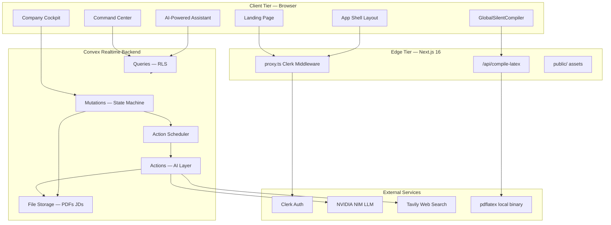
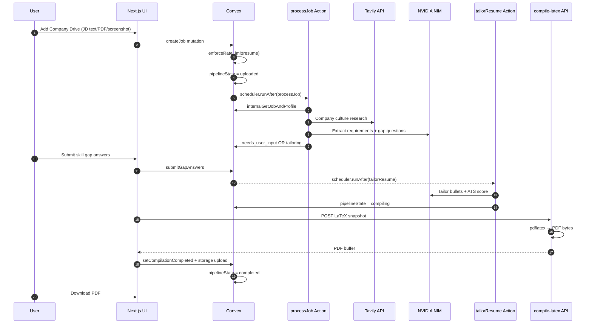
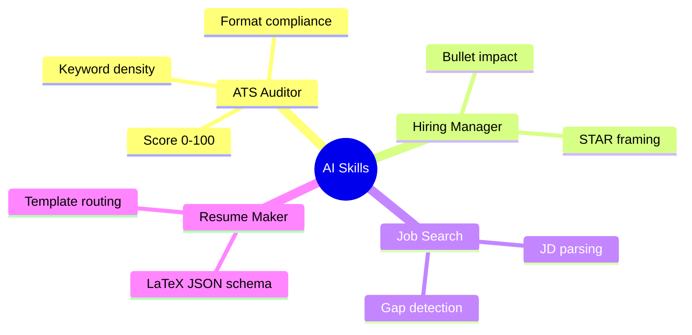
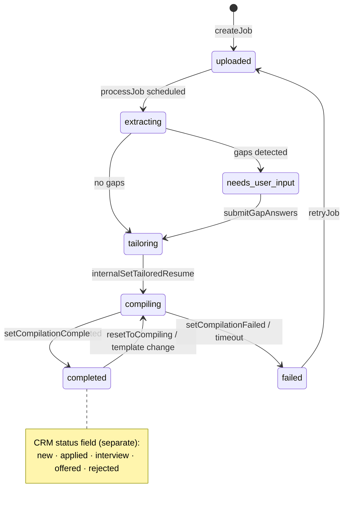
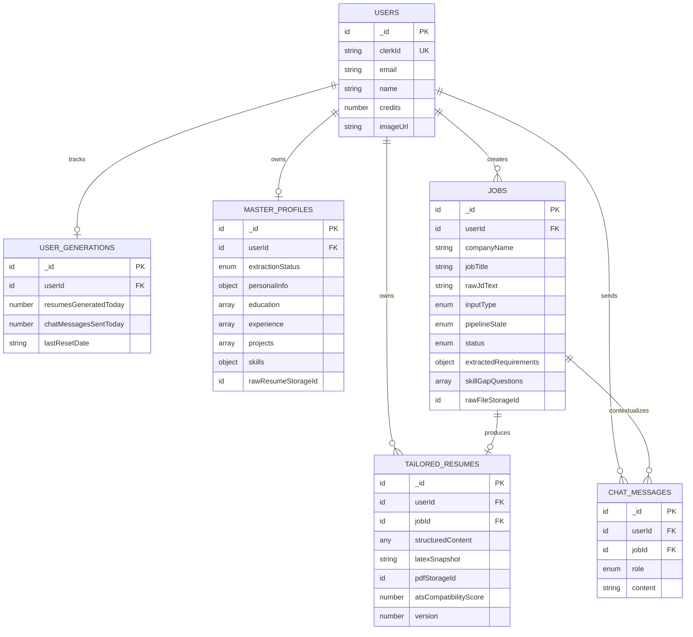
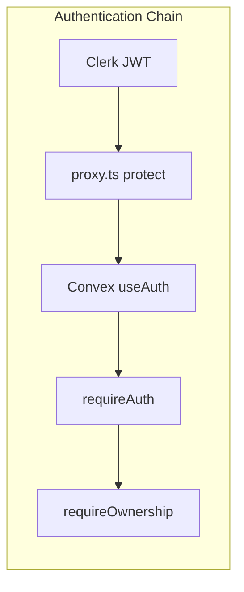
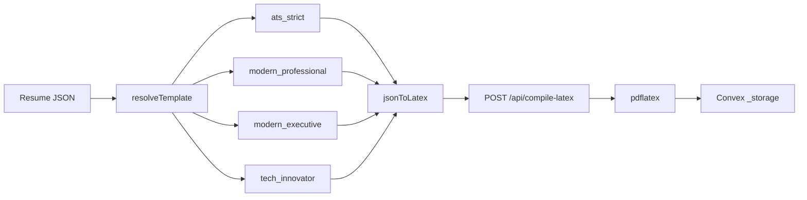
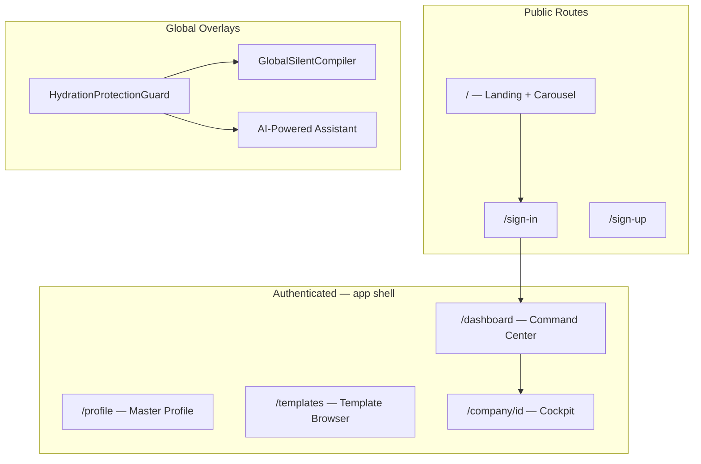

<div align="center">

```
    ╔══════════════════════════════════════════════════════════════════╗
    ║  ▄▀▀▄  ResumeFlow  ─  High-Velocity AI Career Engine             ║
    ║  ▀▄▄▀  One Profile · Every Resume · Zero Effort                  ║
    ╚══════════════════════════════════════════════════════════════════╝
         ▲                    ▲                    ▲
        ╱ ╲                  ╱ ╲                  ╱ ╲
       ╱   ╲   Real-time    ╱   ╲   AI Pipeline ╱   ╲  LaTeX → PDF
      ╱─────╲──────────────╱─────╲─────────────╱─────╲──────────────
```

<br/>

[](https://nextjs.org/)
[](https://react.dev/)
[](https://convex.dev/)
[](https://clerk.com/)
[](https://www.typescriptlang.org/)
[](https://tailwindcss.com/)

**Placement-grade resume engineering platform** — ingest a master profile once, paste any job description, and receive an ATS-optimized, company-researched, LaTeX-compiled PDF in under 30 seconds.

[Live Demo](#) · [Architecture](#-system-architecture) · [Database Schema](#-database-schema) · [Getting Started](#-getting-started)

</div>

---

## Table of Contents

- [Overview](#overview)
- [Core Capabilities](#core-capabilities)
- [System Architecture](#-system-architecture)
- [3-Tier Deployment Topology](#3-tier-deployment-topology)
- [AI Pipeline — Layer 1 & Layer 2](#ai-pipeline--layer-1--layer-2)
- [Job State Machine](#job-state-machine)
- [Database Schema](#-database-schema)
- [Security & Multi-Tenancy](#security--multi-tenancy)
- [LaTeX Compilation Engine](#latex-compilation-engine)
- [Frontend Surface Map](#frontend-surface-map)
- [Project Structure](#project-structure)
- [Environment Variables](#environment-variables)
- [Getting Started](#-getting-started)
- [Scripts](#scripts)
- [License](#license)

---

## Overview

ResumeFlow is a **full-stack, real-time resume tailoring platform** built for placement drives and high-volume job applications. It combines:

| Layer | Technology | Responsibility |
|-------|------------|----------------|
| **Presentation** | Next.js 16 App Router, Framer Motion, Tailwind v4 | Landing, command-center dashboard, company cockpit, template browser |
| **Auth & Edge** | Clerk + `proxy.ts` middleware | JWT sessions, route protection, SSO |
| **Application Logic** | Convex queries, mutations, actions | State machine, RLS, scheduled AI jobs |
| **Intelligence** | NVIDIA NIM (OpenAI-compatible), Tavily | JD extraction, company research, resume tailoring, AI-Powered Assistant |
| **Document Engine** | LaTeX + `pdflatex` API route | ATS-strict PDF generation with template resolution |

---

## Core Capabilities

<details open>
<summary><strong>Master Profile Ingestion</strong></summary>

- PDF / PNG / JPEG upload via `react-dropzone`
- OCR + structured extraction into `masterProfiles`
- 5-state extraction machine: `idle → extracting → success | failed`
- Human-in-the-loop verification bento editor

</details>

<details>
<summary><strong>Placement Command Center</strong></summary>

- Sidebar app shell (`Dashboard` · `Master Profile` · `Templates`)
- Aggregated metrics via `convex/dashboard.ts` (RLS-safe `by_userId` indexes)
- Kanban pipeline board with Framer Motion `layoutId` transitions
- Needs-attention panel for gaps and failed pipelines
- Application CRM status tracking (`new → applied → interview → offered → rejected`)

</details>

<details>
<summary><strong>Company Cockpit</strong></summary>

- 45/55 split workspace: Job Intel + Skill Gaps | Resume Preview
- Inline `SkillGapQuestionnaire` for gap resolution
- Template switcher (4 compile-ready LaTeX engines)
- Manual re-compile with global silent compiler deduplication

</details>

<details>
<summary><strong>AI-Powered Assistant (AI Chat)</strong></summary>

- Context-aware assistant bound to active `jobId`
- Guest preview mode on public routes (2-message FAQ limit)
- Skill registry: ATS Auditor, Hiring Manager, Job Search, Resume Maker

</details>

<details>
<summary><strong>Template Ecosystem</strong></summary>

- 10 preview templates (carousel on landing page)
- 4 production LaTeX compilers: `ats_strict`, `modern_professional`, `modern_executive`, `tech_innovator`
- Resume.io-style template browser with Edit / Customize tabs

</details>

---

## System Architecture

### High-Level C4 Container View



### End-to-End Request Flow (Resume Tailoring)



### 3-Tier Deployment Topology

```
┌─────────────────────────────────────────────────────────────────────────┐
│                         TIER 1 — EDGE / CDN                             │
│  ┌─────────────┐  ┌─────────────┐  ┌─────────────┐  ┌─────────────────┐ │
│  │ Clerk JWT   │  │ proxy.ts    │  │ Static CDN  │  │ SSR / RSC       │ │
│  │ Validation  │  │ Route Guard │  │ public/*    │  │ App Router      │ │
│  └──────┬──────┘  └──────┬──────┘  └─────────────┘  └────────┬────────┘ │
└─────────┼────────────────┼────────────────────────────────────┼─────────┘
          │                │                                    │
          ▼                ▼                                    ▼
┌─────────────────────────────────────────────────────────────────────────┐
│                    TIER 2 — APPLICATION (Convex Cloud)                    │
│                                                                         │
│   ┌──────────────┐   ┌──────────────┐   ┌──────────────┐               │
│   │   Queries    │   │  Mutations   │   │   Actions    │               │
│   │  getMyJobs   │   │  createJob   │   │  processJob  │               │
│   │ getDashboard │   │ submitGaps   │   │ tailorResume │               │
│   │ getProfile   │   │ setCompiled  │   │ extractProf  │               │
│   └──────┬───────┘   └──────┬───────┘   └──────┬───────┘               │
│          │                  │                  │                        │
│          └──────────────────┼──────────────────┘                        │
│                             ▼                                           │
│              ┌──────────────────────────────┐                            │
│              │     Convex Document Store   │                            │
│              │  users · jobs · profiles    │                            │
│              │  tailoredResumes · chat     │                            │
│              └──────────────────────────────┘                            │
└─────────────────────────────────────────────────────────────────────────┘
          │                                    │
          ▼                                    ▼
┌─────────────────────────────────────────────────────────────────────────┐
│                   TIER 3 — EXTERNAL INTELLIGENCE                        │
│  ┌─────────────────┐  ┌─────────────────┐  ┌─────────────────────────┐│
│  │ NVIDIA NIM API  │  │ Tavily Search   │  │ Local pdflatex Engine   ││
│  │ LLM Inference   │  │ Company Intel   │  │ /api/compile-latex      ││
│  └─────────────────┘  └─────────────────┘  └─────────────────────────┘│
└─────────────────────────────────────────────────────────────────────────┘
```

---

## AI Pipeline — Layer 1 & Layer 2

| Layer | Action | Input | Output |
|-------|--------|-------|--------|
| **L0** | `extractProfile` | Raw resume PDF/image | Structured `masterProfiles` document |
| **L1** | `processJob` | JD text / PDF / screenshot | `extractedRequirements`, `skillGapQuestions`, Tavily `companyInsights` |
| **L2** | `tailorResume` | Profile + requirements + gap answers | `structuredContent`, `atsCompatibilityScore`, `diffNotes` |
| **L3** | `compile-latex` | LaTeX snapshot | Binary PDF → Convex `_storage` |
| **Chat** | `chatAssistant` | User message + job context | AI-Powered Assistant response |

### Skill Registry (`convex/ai/Skills/registry.ts`)



---

## Job State Machine



---

## Database Schema

### Entity-Relationship Diagram



### Indexes (Performance-Critical)

| Table | Index | Purpose |
|-------|-------|---------|
| `users` | `by_clerkId` | Clerk JWT → internal user resolution |
| `userGenerations` | `by_userId` | Daily rate-limit lookups |
| `masterProfiles` | `by_userId` | Profile gate on every session |
| `jobs` | `by_userId` | Kanban board listing |
| `jobs` | `by_userId_state` | Pipeline funnel aggregation |
| `tailoredResumes` | `by_jobId` | O(1) resume join per job |
| `tailoredResumes` | `by_userId` | RLS-safe dashboard stats |
| `chatMessages` | `by_userId` | Chat history retrieval |

### `pipelineState` Enum

```
uploaded → extracting → needs_user_input → tailoring → compiling → completed | failed
```

### `status` Enum (Application CRM — post-completion only)

```
new → applied → interview → offered → rejected
```

---

## Security & Multi-Tenancy



| Control | Implementation | File |
|---------|----------------|------|
| **Route protection** | Clerk `auth.protect()` on `/dashboard`, `/profile`, `/company`, `/templates` | `proxy.ts` |
| **Row-Level Security** | `requireAuth` + `requireOwnership` on every mutation | `convex/lib/auth.ts` |
| **PII firewall** | Mask before LLM, re-inject after tailoring | `convex/lib/piiMask.ts` |
| **Rate limiting** | 5 resumes/day · 50 chat messages/day | `convex/lib/rateLimit.ts` |
| **Upload validation** | 5 MB cap · PDF/PNG/JPEG only | `convex/lib/uploadValidation.ts` |
| **Tenant-safe aggregates** | `by_userId` index — never full-table scan | `convex/dashboard.ts` |
| **Compiler lock** | `Set`-based global mutex, 90s timeout | `GlobalSilentCompiler.tsx` |

---

## LaTeX Compilation Engine



| Template ID | Engine File | Use Case |
|-------------|-------------|----------|
| `ats_strict` | `lib/latex/templates/atsStrict.ts` | Default ATS parsing layout (Jake's Resume) |
| `modern_professional` | `modernProfessional.ts` | Startup / creative accent |
| `modern_executive` | `modernExecutive.ts` | Finance / executive two-tone |
| `tech_innovator` | `techInnovator.ts` | Engineering / sidebar tech layout |

---

## Frontend Surface Map



### UI/UX Stack

- **Design tokens**: Pinterest-inspired warm cream palette (`app/globals.css`)
- **Motion**: Framer Motion staggered entrances, Kanban `layoutId` springs
- **Components**: shadcn-adjacent patterns, Lucide icons, Bento grids
- **Responsive**: Sidebar shell (desktop) · horizontal Kanban scroll (mobile)

---

## Project Structure

```
ResumeFlow/
├── app/
│   ├── (app)/                    # Authenticated app shell (sidebar layout)
│   │   ├── layout.tsx            # Dashboard · Profile · Templates nav
│   │   ├── dashboard/page.tsx    # Placement Command Center
│   │   ├── profile/page.tsx      # Master profile bento editor
│   │   ├── templates/page.tsx    # Template browser
│   │   └── company/[id]/page.tsx # 45/55 company cockpit
│   ├── api/compile-latex/        # pdflatex compilation endpoint
│   ├── sign-in/ · sign-up/       # Clerk auth pages
│   ├── page.tsx                  # Marketing landing page
│   └── layout.tsx                # Root providers
├── components/
│   ├── KanbanBoard.tsx           # Pipeline kanban
│   ├── GlobalSilentCompiler.tsx  # Deduped PDF compiler
│   ├── ChatBot.tsx               # AI-Powered Assistant
│   ├── SkillGapQuestionnaire.tsx
│   ├── TemplateCarousel.tsx
│   ├── HydrationProtectionGuard.tsx
│   └── templates/                # Template browser tabs
├── convex/
│   ├── schema.ts                 # Document schema + indexes
│   ├── jobs.ts                   # Job state machine mutations
│   ├── dashboard.ts              # Aggregated stats query
│   ├── profiles.ts · users.ts · chat.ts
│   ├── ai/
│   │   ├── processJob.ts         # Layer 1 — JD analysis
│   │   ├── tailorResume.ts       # Layer 2 — resume tailoring
│   │   ├── extractResume.ts      # Profile OCR extraction
│   │   ├── chatAssistant.ts      # AI-Powered Assistant
│   │   └── Skills/registry.ts    # Prompt skill library
│   └── lib/
│       ├── auth.ts               # RLS helpers
│       ├── rateLimit.ts          # Daily quotas
│       └── piiMask.ts            # PII masking firewall
├── lib/
│   ├── latex/                    # LaTeX template engines
│   └── templates/navigation.ts
├── public/
│   ├── images/                   # Template previews + feature art
│   ├── hero-demo.mp4             # Landing hero video
│   └── hero-poster.jpg           # Video poster frame
└── proxy.ts                      # Clerk middleware (Next.js 16)
```

---

## Environment Variables

### Next.js (`.env.local`)

| Variable | Required | Description |
|----------|----------|-------------|
| `NEXT_PUBLIC_CONVEX_URL` | Yes | Convex deployment URL |
| `NEXT_PUBLIC_CLERK_PUBLISHABLE_KEY` | Yes | Clerk frontend key |
| `CLERK_SECRET_KEY` | Yes | Clerk backend key |

### Convex Dashboard

| Variable | Required | Description |
|----------|----------|-------------|
| `CLERK_JWT_ISSUER_DOMAIN` | Yes | Clerk JWT issuer for Convex auth |
| `NVIDIA_NIM_API_KEY` | Yes | LLM inference (OpenAI-compatible) |
| `TAVILY_API_KEY` | Yes | Company web research |

### System Requirements

| Dependency | Purpose |
|------------|---------|
| `pdflatex` (MacTeX / TeX Live) | PDF compilation via `/api/compile-latex` |
| Node.js 20+ | Next.js 16 runtime |
| Convex CLI | `npx convex dev` for backend sync |

---

## Getting Started

### Prerequisites

```bash
node -v          # v20+
npx convex -v    # Convex CLI
which pdflatex   # LaTeX engine (optional for local PDF compile)
```

### Installation

```bash
git clone https://github.com/your-org/ResumeFlow.git
cd ResumeFlow
npm install
```

### Configure environment

```bash
cp .env.example .env.local   # create if not present — add keys below
```

```env
NEXT_PUBLIC_CONVEX_URL=https://your-deployment.convex.cloud
NEXT_PUBLIC_CLERK_PUBLISHABLE_KEY=pk_test_...
CLERK_SECRET_KEY=sk_test_...
```

Set Convex env vars in the [Convex Dashboard](https://dashboard.convex.dev):

```
CLERK_JWT_ISSUER_DOMAIN=https://your-clerk-domain.clerk.accounts.dev
NVIDIA_NIM_API_KEY=nvapi-...
TAVILY_API_KEY=tvly-...
```

### Run development

```bash
# Terminal 1 — Convex backend
npx convex dev

# Terminal 2 — Next.js frontend
npm run dev
```

Open [http://localhost:3000](http://localhost:3000)

### Production build

```bash
npm run build
npm start
```

---

## Scripts

| Command | Description |
|---------|-------------|
| `npm run dev` | Start Next.js dev server (Turbopack) |
| `npm run build` | Production build + typecheck |
| `npm start` | Serve production build |
| `npm run lint` | ESLint |
| `npx convex dev` | Sync Convex functions + generate types |
| `npx tsc --noEmit` | Strict TypeScript validation |

---

## License

This project is proprietary. All rights reserved.

---

<div align="center">

**ResumeFlow** — Engineered for placement velocity.

```
     ┌─────────────────────────────────────────┐
     │  Convex ◄──► React ◄──► LaTeX ◄──► PDF │
     │         real-time    compile    deliver │
     └─────────────────────────────────────────┘
```

</div>
